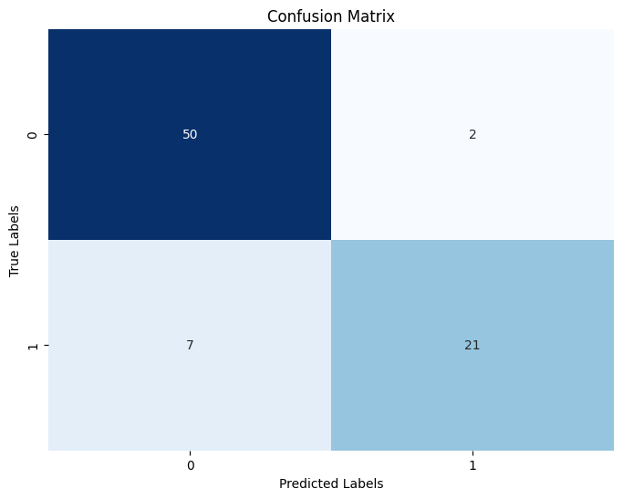

Naïve Bayes' classification algorithm

*Author: Francisco Javier Sánchez Panduro\
Supervised by Professor Doctor Brenda García Maya\
Monterrey Institute of Tecnology and Higher Studies\
21 of August 2023*

# Introduction
According to Saritas and Yasar (2019), the Naive Bayes algorithm is a probability classifier that calculates probability by counting the frequency and combination of values in a given data set. It is based on Bayes' Theorem and makes the naive assumption that all variables are independant. 

In this document we aim to apply Naive Bayes' classifcation algorithm to predict using age and estimated salary weather they could be a potential buyer. 

# Bayes theorem

According to Saritas and Yasar (2019), Bayes' theorem goes as follows:

$$
P(A|B) = \frac{P(A)·P(B|A)}{P(B)}
$$

Where:

$P(A)$ is the probability of occurrence of event $A$.\
$P(B)$ is the probability of occurrence of event $B$.\
$P(A|B)$ is the probability of the occurrence of event $A$ when event $B$ occurs.\
$P(B|A)$ is the probability of occurrence of event $B$ when event $A$ occurs.

Naive Bayes is employed to generate a confusion matrix, wherein the accurately predicted values are juxtaposed against the actual values. In this matrix, the diagonal elements signify the accurate predictions, while the remaining values indicate instances of incorrect predictions.

# Application

## Libraries to be used


```python
import pandas as pd
from sklearn.model_selection import train_test_split
from sklearn.naive_bayes import GaussianNB
from sklearn.metrics import confusion_matrix
import matplotlib.pyplot as plt
import seaborn as sns
```

## Data preparation


```python
df = pd.read_csv('./data/Social_Network_Ads.csv')
df.head()
```


<div>
<style scoped>
    .dataframe tbody tr th:only-of-type {
        vertical-align: middle;
    }

    .dataframe tbody tr th {
        vertical-align: top;
    }

    .dataframe thead th {
        text-align: right;
    }
</style>
<table border="1" class="dataframe">
  <thead>
    <tr style="text-align: right;">
      <th></th>
      <th>User ID</th>
      <th>Gender</th>
      <th>Age</th>
      <th>EstimatedSalary</th>
      <th>Purchased</th>
    </tr>
  </thead>
  <tbody>
    <tr>
      <th>0</th>
      <td>15624510</td>
      <td>Male</td>
      <td>19</td>
      <td>19000</td>
      <td>0</td>
    </tr>
    <tr>
      <th>1</th>
      <td>15810944</td>
      <td>Male</td>
      <td>35</td>
      <td>20000</td>
      <td>0</td>
    </tr>
    <tr>
      <th>2</th>
      <td>15668575</td>
      <td>Female</td>
      <td>26</td>
      <td>43000</td>
      <td>0</td>
    </tr>
    <tr>
      <th>3</th>
      <td>15603246</td>
      <td>Female</td>
      <td>27</td>
      <td>57000</td>
      <td>0</td>
    </tr>
    <tr>
      <th>4</th>
      <td>15804002</td>
      <td>Male</td>
      <td>19</td>
      <td>76000</td>
      <td>0</td>
    </tr>
  </tbody>
</table>
</div>


```python
# Split training and testing data
# Taking columns 2 and 3 to as independent variables, and column 4 as the dependent variable
x_train, x_test, y_train, y_test = train_test_split(df.iloc[:, 2:4], df.iloc[:, 4], test_size=0.2)
```

## Applying naive bayes and creating the confussion matrix


```python
# Create model object
nb = GaussianNB()
# Fit model to training data 
nb.fit(x_train, y_train)
# Predict dependent variables
y_pred = nb.predict(x_test)
```


```python
# Model accuracy
nb.score(x_test, y_test)
```


    0.8875


```python
### Creating the confussion matrix
```


```python
conf_matrix = confusion_matrix(y_test, y_pred)
```


```python
# Create a heatmap for the confusion matrix
plt.figure(figsize=(8, 6))
sns.heatmap(conf_matrix, annot=True, fmt="d", cmap="Blues", cbar=False)
plt.xlabel("Predicted Labels")
plt.ylabel("True Labels")
plt.title("Confusion Matrix")
plt.show()
```


    

    


# References

Saritas, M. M., & Yasar, A. (2019). Performance Analysis of ANN and Naive Bayes Classification Algorithm for Data Classification. International Journal of Intelligent Systems and Applications in Engineering, 7(2), 88–91. https://doi.org/10.18201//ijisae.2019252786
